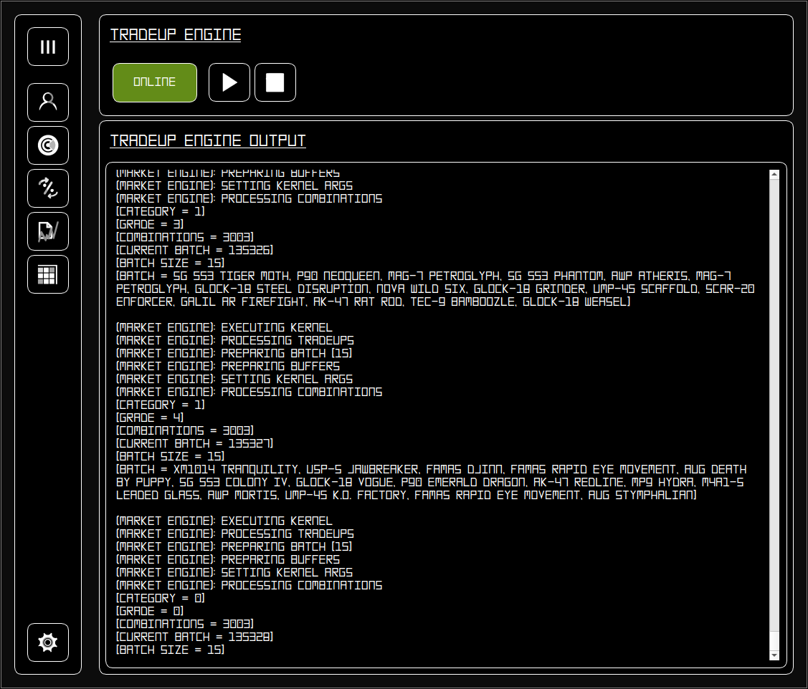

# Market Engine Client

## Overview

This is a CPU/GPU-powered CS2 trade-up engine built to calculate millions of trade-ups as fast as possible. You can run it on your CPU, or hook up as many GPUs as you’ve got (works across vendors). The engine is very configurable and offers various settings to maximise efficiency. Includes a manager to keep track of all the trade-ups you've found and an item viewer so you can browse every CS2 market item and its details. Trade-ups are hashed, so you won’t get duplicates, and in turn save time. This is a desktop app that runs locally on your machine.

Part of the Market Engine project. NOT AFFILIATED WITH VALVE OR ANY OTHER SERVICES.

## Early Access

This project is in very early access and bugs are expected. The client was originally designed for Linux + CPU compute and may have some bugs regarding Windows and certain hardware.
The GPU Engine may be slower than the CPU engine currently and is being worked on.

## Website

https://marketengine.onefil.dev

## Downloads

For prebuilt Windows installers and Linux Appimages, head over to https://marketengine.onefil.dev/downloads

## How to use

For instructions on how to operate the software, refer to the documentation at https://marketengine.onefil.dev/docs  
If you experience any issues, visit the discord: https://discord.gg/tM53kbYVa6

## Building from source

Building happens in the shell network. Follow the instructions at https://github.com/1FIL0/Market-Engine-Shell-Network.

## LICENCE

Read the LICENCE file

